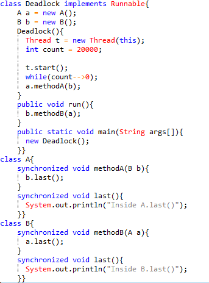
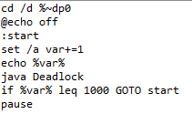
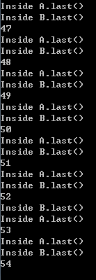

## 死锁
###产生死锁的4个必要条件：
死锁就是两个或多个进程，互相请求被对方占有的资源。产生死锁的条件如下：

* 互斥条件：一个资源每次只能被一个进程使用；
* 请求与保持条件：一个进程因请求资源而阻塞时，对已获得的资源保持不放；
* 不剥夺条件：进程已获得的资源，在未使用完之前，不能强行剥夺；
* 循环等待条件：若干进程之间形成一种头尾相接的循环等待资源关系
***
###测试：
* 新建一个java文件，内容如下：

	

* 编译该文件，然后新建一个.bat文件，内容如下：

	

* 双击bat文件，使程序运行一百遍，多少次停是随机的，调节程序中count值，使其发生死锁。本次实验跑到54次的时候停了，如图：

	
***
###分析：
关键字synchronized：

*  当它用来修饰一个方法或者一个代码块的时候，能够保证在同一时刻最多只有一个线程执行该段代码。
*  当一个线程访问object的一个synchronized同步代码块或同步方法时，其他线程对object中所有其它synchronized同步代码块或同步方法的访问将被阻塞。

Deadlock函数相当于主线程，run函数是子线程。实验开始的时候在主线程中创建了子线程 t ，然后t.start()之后，线程就被调度到队列里，然后主线程等待20000，之后执行a对象的methodA()方法，在执行过程中，主线程的时间片用完了，则cpu调度子线程，子线程执行b对象的methodB()方法，这个方法里面是调用a对象的last()方法，而此代码块有关键词synchronized，主线程又拥有methodA()的锁，所以子线程被阻塞，等待着主线程释放资源，而同时主线程也被阻塞等待子线程释放资源，所以产生了死锁。
***
###感想：
实验过程比较简单，没遇到什么大问题。通过本次实验，复习了关于产生死锁的四个必要条件，对于死锁也有了更加深刻的认识。

