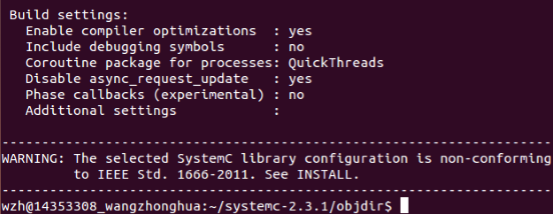
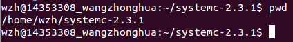
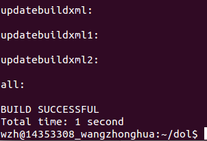
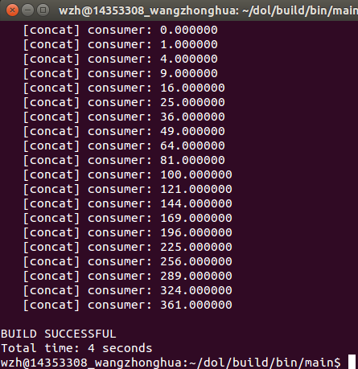

## Dol配置文档
### **框架描述：**
*Distributed operation layer (DOL) is a software development framework to program parallel applications. The DOL allows to specify applications based on the Kahn process network model of computation and features a simulation engine based on SystemC. Moreover, the DOL provides an XML-based specification format to describe the implementation of a parallel application on a multi-processor systems, including binding and mapping.*
### **配置步骤：**
**1. 安装必要的环境**

         $ sudo apt-get update
         $ sudo apt-get install ant
         $ sudo apt-get install openjdk-7-jdk
         $ sudo apt-get install unzip
**2. 下载文件**

         $sudo wget http://www.accellera.org/images/downloads/standards/systemc/systemc-2.3.1.tgz
         $sudo wget http://www.tik.ee.ethz.ch/~shapes/downloads/dol_ethz.zip
**3. 解压文件**

   新建dol的文件夹:

         $ mkdir dol

   将dolethz.zip解压到dol文件中:

         $ unzip dol_ethz.zip -d dol
   解压systemc

         $ tar -zxvf systemc-2.3.1.tgz
**4. 编译systemc**

   解压后进入systemc-2.3.1的目录下
         
         $cd systemc-2.3.1

   新建一个临时文件夹objdir

     	$ mkdir objdir

   进入该文件夹objdir

		$ cd objdir

   运行configure（可以根据系统的环境设置一下参数，用于编译）

		$ ../configure CXX=g++ --disable-async-uppdates

   得到如下结果:

   
         
   编译：

		$ sudo make install

   编译后的文件目录：

   

   记录当前的工作路径：
 	
		$ pwd

   输出结果：

   

**5. 编译Dol**
    
   进入刚刚创建的Dol文件夹

		$ cd dol
   修改build_zip.xml文件，将其用记事本方式打开，找到下面这两句话：

		<property name="systemc.inc" value="YYY/include"/>
		<property name="systemc.lib" value="YYY/lib-linux/libsystemc.a"/>

   把YYY改成之前pwd命令得到的结果，即:

		/home/wzh/systemc-2.3.1

   然后编译：

		$ ant -f build_zip.xml all

   结果显示如下，说明成功：

   

   然后就试着运行第一个例子：

		$ cd build/bin/main
		$ sudo ant -f runexample.xml -Dnumber=1

   结果如下，说明配置成功：

   

### **实验感想：**
通过本次实验，成功配置了Dol，对于Dol有了初步的了解。实验过程中遇到的问题：

1. 最后的build失败，经过仔细检查，在修改build_zip.xml的时候把应该是linux的地方改成了linux64，误解了PPT上的“机器”的意思，误以为是自己主机的操作系统，最后发现是指Ubuntu。
2. Ubuntu在配置过程中断网了，然后连不上网络，通过请教同学，成功解决。首先要打开电脑的管理器，打开服务项，找到VMware的相关服务，把手动改为自动，把未启动的服务手动启动，然后就可以了。 

   

