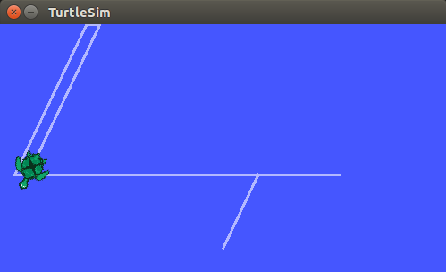
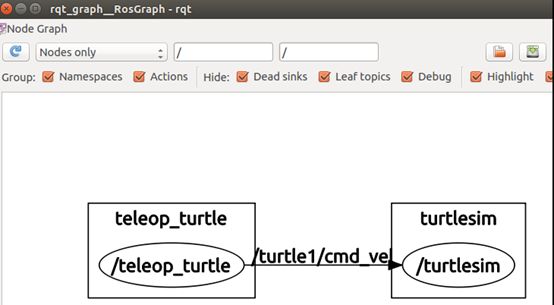

##ROS的安装和测试
###安装过程：
可参考[中文教程](http://wiki.ros.org/cn/jade/Installation/Ubuntu):

1.配置Ubuntu软件仓库，可以参考教程[按照Ubuntu中的配置指南](https://help.ubuntu.com/community/Repositories/Ubuntu)

2.添加source.list，配置Ubuntu使其能够安装来自packages.ros.org的软件包：

		$ sudo sh -c 'echo "deb http://packages.ros.org/ros/ubuntu $(lsb_release -sc) main" > /etc/apt/sources.list.d/ros-latest.list'

3.添加keys：

		$ sudo apt-key adv --keyserver hkp://pool.sks-keyservers.net --recv-key 0xB01FA116

4.安装：

* 首先确保Debian软件包索引是最新的：

		$ sudo apt-get update
* 桌面完整版安装：

		$ sudo apt-get install ros-jade-desktop-full

5.初始化rosdep：

		$ sudo rosdep init
		$ rosdep update

6.环境配置：

		$ echo "source /opt/ros/jade/setup.bash" >> ~/.bashrc
		  source ~/.bashrc

7.安卓rosinstall：

		$ sudo apt-get install python-rosinstall
***
###测试：

* 打开一个终端，输入指令：

		$ roscore
没有错误提示，继续之后的步骤，但是要保证这个终端一直开着，不能关掉。

* 打开第二个终端，输入指令，可以看到出现一个蓝色的界面，有一只小海龟：

		$ rosrun turtlesim turtlesim_node

* 接着打开第三个终端，输入指令如下，用来接收键盘输入，控制小海龟移动

		$ rosrun turtlesim turtle_teleop_key

* 选中第三个终端，在键盘上按上下左右键，可以看到小海龟的移动，结果如图：

    

* 打开第四个终端，输入指令如下：

		$  rosrun rqt_graph rqt_graph

    可以看到如下结果：
    
	

	由上图可看见，左右两边矩形为ROS node，中间连线上是Topic名称。

*至此ROS的安装与测试结束。*
***
###实验感想：

  本次实验过程比较简单，基本都是根据教程一步步来的，没出什么问题。关于ROS的简介详情见[ROS简介](http://blog.csdn.net/hcx25909/article/details/8795043)。
  
  
