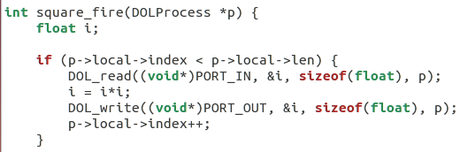
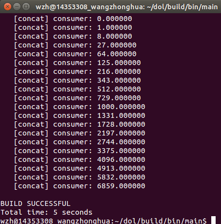
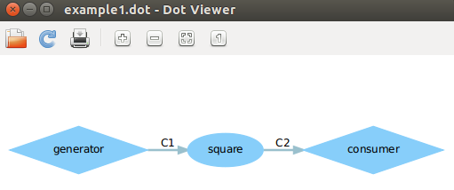
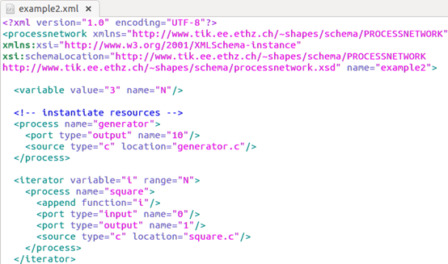
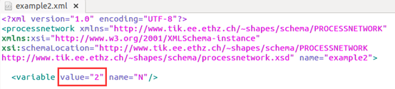
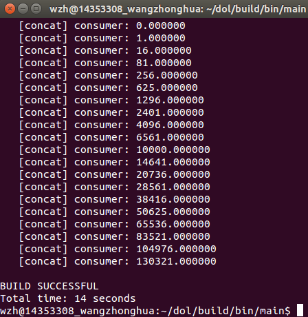
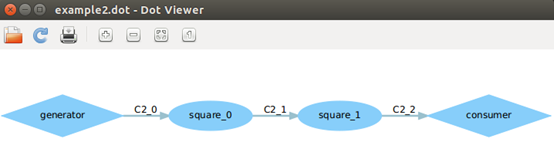

##DOL实例分析&编程
###实验任务：
1、修改example1，使其输出3次方数，tips：修改square.c

2、修改example2，让3个suqare模块变成两个，tips：修改xml的iterator
***
###实验过程：
1、了解example中各个文件的含义：看看课件就可以。

2、修改代码：

 * **修改example1：**
	
   首先进到文件夹 dol/examples/example1/src,找到square.c文件:

   

   可以看到其中DOL_ read((void* )PORT_ IN,&i,sizeof(float),p);读square的端口“PORT_ IN”, 将值读到i，然后进行了一个平方，然后DOL_ write((void* )PORT_ OUT,&i,sizeof(float),p);写square的端口“PORT_OUT”，把i写到这个端口。由此可知我们如果要输出3次方数，只需要把把做平方的那一步变成做立方就可以了，即把i = i * i，变成i = i * i * i 即可，完成后保存文件，运行example1：

		$ cd dol/build/bin/main/
		$ ant -f runexample.xml -Dnumber=1
   结果出错；

   然后仔细检查了一下，发现build/bin/main/example1下的profile文件被锁定了，这说明它无法被修改，所以程序运行才会出错。因为其被锁定也没法被删除，所以查了下资料，然后先在同一目录下新建了一个名为profile1的文本文件，然后把profile文件的内容全都复制到了新文件，然后执行了如下命令：

		$ sudo rm dol/build/bin/main/profile.txt -r
		$ 输入密码
   
   然后进入文件夹，发现被锁定的profile已经被删除，然后把profile1重命名为profile，然后用和上面一样的指令重新运行example1，得到结果如下，可见输出的结果都是3次方数，结果正确：

   

   .dot文件如下：
   
   

   至此，对于example1的修改任务结束。

 * **修改example2：**
	
   根据提示，先找到example2.xml文件：

   

   通过之前对代码的了解可以看到example2通过迭代定义了三个平方模块，我们需要做的就是把迭代的次数从3变为2，那么就很简单了，修改如下：

   
   
   运行example2：
	
		$ ant -f runexample.xml -Dnumber=2

   结果如下,由于是两个平方模块，所以输出的是 i 的 4 次方数，结果正确：
 
   

   .dot文件如下：

   

***
###实验感想：

   本次实验比较简单，实验过程都是根据PPT的提示进行，没有遇到太大的问题。其中修改example1时因为profile文件被锁定而无法被修改算是比较重要的一个问题，但是通过查资料，很快就解决了。

   

   
